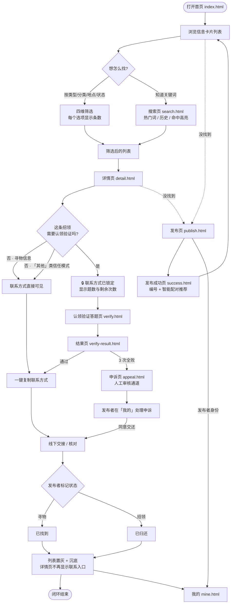
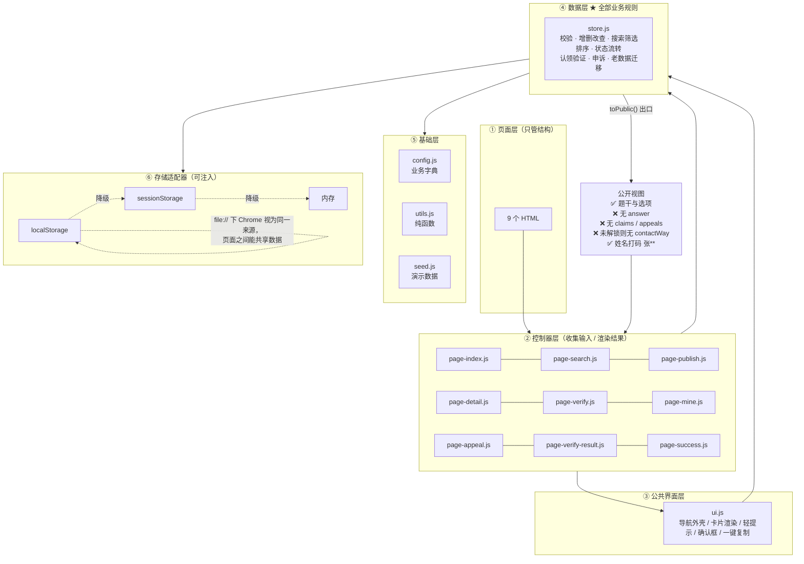
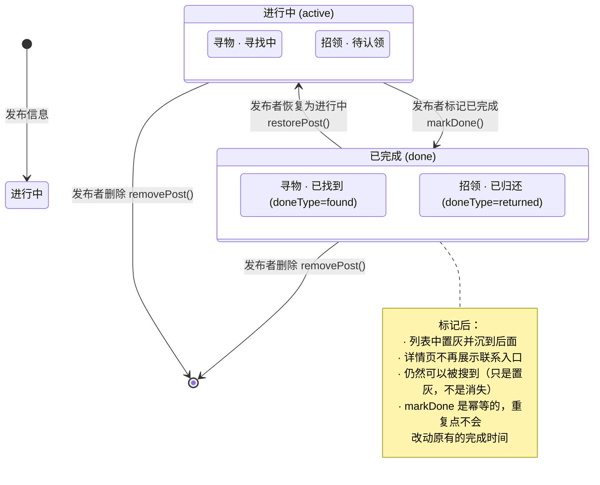
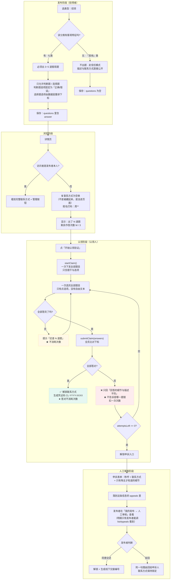

# 流程图

> 四张图：用户使用流程、数据流与分层、状态流转、认领验证（核心机制）。
> 用 Mermaid 写，GitHub 上可以直接渲染；也可以粘到 <https://mermaid.live> 导出成图片放进博客。

---

## 图 1：用户使用流程（主闭环）

对应作业要求点名的：**发布信息 → 浏览 / 搜索 → 查看详情 → 联系发布者 → 更新状态**。

---

## 图 2：数据流与分层

一条最关键的设计：**数据层向上返回的每一个对象都经过 `toPublic()`，验证题的正确答案在这一步被剥离，认领记录与申诉明细同样不外传。** 首页、搜索结果、详情页、答题页拿到的数据里根本不存在正确答案——不是靠界面藏起来，而是数据压根没传出来。

---

## 图 3：信息状态流转

状态字段只有 `active / done` 两个取值，**状态文案由「类型 × 状态」两两组合推导**，界面层只认 `LF.statusTextOf()`，避免文案散落各处。

---

## 图 4：认领验证（核心机制）

这张图里有四个地方是**特意**设计的，也是这一版与"第一版想法"的区别所在。

### 图里四个"特意"的地方

| # | 设计 | 如果不这么做会怎样 |
| --- | --- | --- |
| 1 | **题型只有判断和选择** | 判定退回字符串比对，「深蓝 / 藏青」这类措辞歧义会把真失主拦在门外，而且"宽容到什么程度"没有正确答案 |
| 2 | **一次性作答 + 统一判定** | 逐题反馈等于给冒领者递排除法的线索，3 次机会足够把答案试出来 |
| 3 | **次数上限写进数据层** | `attemptsLeft` 存在信息上、扣减只发生在 `submitClaim()` 内部，绕过界面直接调数据层也躲不开 |
| 4 | **3 次用完才解锁申诉** | `canAppeal` 由"剩余次数是否为 0"推导，认领页、结果页、详情页三处按钮都以它为准，不会出现"提前出现申诉入口" |
